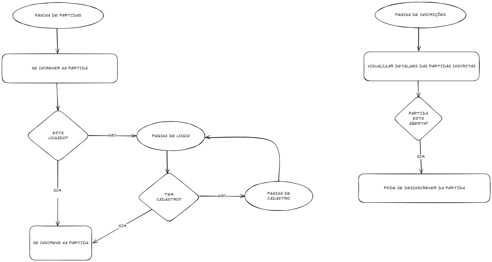

---

# Gerenciamento – Court Connect  

## Documento de Requisitos  
**Versão:** 1.0  
**Data:** 12/03/2025  

---

## Colaboradores

- **Arquiteto de Software:** Ronaldo Junior

---

## Histórico de Revisões

| Versão | Data       | Autor   | Descrição         |
|--------|------------|---------|-------------------|
| 1.0    | 12/03/2025 | Ronaldo | Documento inicial |
| 1.5    | 17/04/2025 | Ronaldo | Diagrama & API |

---

## Índice

1. [Introdução](#1-introdução)  
   1.1 [Propósito](#11-propósito)  
   1.2 [Público-alvo](#12-público-alvo)  
   1.3 [Escopo](#13-escopo)  
2. [Visão Geral do Produto](#2-visão-geral-do-produto)  
3. [Escopo Não Contemplado](#3-escopo-não-contemplado)  
4. [Requisitos Funcionais](#4-requisitos-funcionais)  
5. [Regras de Negócio](#5-regras-de-negócio)  
6. [Requisitos Não Funcionais](#6-requisitos-não-funcionais)  
7. [Diagrama do fluxo da aplicação](#7-diagrama-do-fluxo-da-aplicação)  
8. [Cronograma](#8-cronograma)  
9. [Técnica de Levantamento de Requisitos](#8-técnica-de-levantamento-de-requisitos)  
    9.1 [Atas](#91-atas)  

---

## 1. Introdução

### 1.1 Propósito

Este documento especifica os requisitos dos sistemas a serem desenvolvidos, fornecendo aos desenvolvedores as informações necessárias para o projeto e implementação.  

O sistema viabiliza uma plataforma na qual será possível, como usuário, se cadastrar, visualizar partidas disponíveis e se inscrever em partidas como jogador, oferecendo controle para o treinador e para o usuário quanto ao local e horário da partida.

### 1.2 Público-alvo

Destinado ao proprietário (cliente) e aos desenvolvedores responsáveis pelo sistema.

### 1.3 Escopo

O software para a Court Connect incluirá:
- Tela de cadastro de jogador
- Tela de login
- Visualização de partidas
- Gerenciamento de participação
- Agenda do jogador

---

## 2. Visão Geral do Produto

O sistema visa automatizar o agendamento de eventos esportivos, proporcionando aos jogadores controle sobre sua agenda esportiva.

---

## 3. Escopo Não Contemplado

- **Dashboard do treinador**: funcionalidades como gerenciamento de partidas, adição de jogadores, definição de horários e locais **não** serão incluídas nesta versão.

---

## 4. Requisitos Funcionais

- [x] **RF001 – Cadastro de jogadores**  
  Tela com nome, e-mail, CPF e senha. Link para login se já for cadastrado.

- [x] **RF002 – Login de jogadores**  
  Tela de login com e-mail e senha, com link para cadastro e recuperação de senha.

- [ ] **RF003 – Visualização de partidas**  
  Tela que liste as partidas com nome, treinador, status (aberto/concluído), posições (levantador, ponteiro, central, oposto e líbero), data, horário e local.

- [ ] **RF004 – Inscrição de jogadores**  
  Jogadores podem se inscrever em posições disponíveis.

- [ ] **RF005 – Desinscrição de jogadores**  
  Jogadores podem se desinscrever da partida.

- [ ] **RF006 – Visualização de inscrições**  
  Tela com inscrições ativas, com detalhes e link para partida.

---

## 5. Regras de Negócio

- [ ] **RN001 – Visualização de partidas**  
  Apenas partidas com vagas disponíveis devem ser exibidas.

- [ ] **RN002 – Inscrição em partidas**  
  Jogador só pode se inscrever em uma posição por partida, e apenas se ela estiver livre.

- [ ] **RN003 – Desinscrição em partidas**  
  Permitida apenas enquanto a partida estiver com status "aberto".

- [ ] **RN004 – Visualização de inscrições ativas**  
  Jogador só pode visualizar suas próprias inscrições ativas.

- [x] **RN005 – Visualização do clima do local da partida**  
  Ao ver detalhes sobre a partida, o sistema deve exibir o clima do local da partida.

---

## 6. Requisitos Não Funcionais

- [x]  **RNF001 – Persistência dos dados de login**  
  Autenticação armazenada em Local Storage.

- [ ] **RNF002 – Layout responsivo**  
  Sistema deve funcionar bem em desktop, tablet e mobile.

- [x] **RNF003 – API de clima**  
  Sistema deve utilizar a `goweather.herokuapp` API para exibir o clima.

---

## 7. Diagrama do fluxo da aplicação

## 8. Cronograma
- [07/04/2025] - Entrega da tela de visualização de equipes inscritas.
- [12/04/2025] - Entrega do documento de requisitos da aplicação requisitada por mim.
- [16/04/2025] - Reunião para discutir a respeito do andamento do projeto (esperado que os requisitos acordados estejam sendo desenvolvidos)
- [25/04/2025] - Entrega da tela de busca de equipes (totalmente funcional)
- [17/05/2025] - Entrega do projeto funcional (de acordo com o documento de requisitos)

## 9. Técnica de Levantamento de Requisitos

- **Entrevista com stakeholders**  
  A equipe se reuniu com a cliente para entender funcionalidades essenciais e desnecessárias.

### 9.1 Atas
- [03/04/2025] - Foi discutido a documentação e as próximas reuniões de alinhamento.
- [09/04/2025] - Reunião para desenvolvimento dos projetos (pair programming).
- [16/04/2025] - Revisão das funcionalidades pedidas pelo professor.
---
